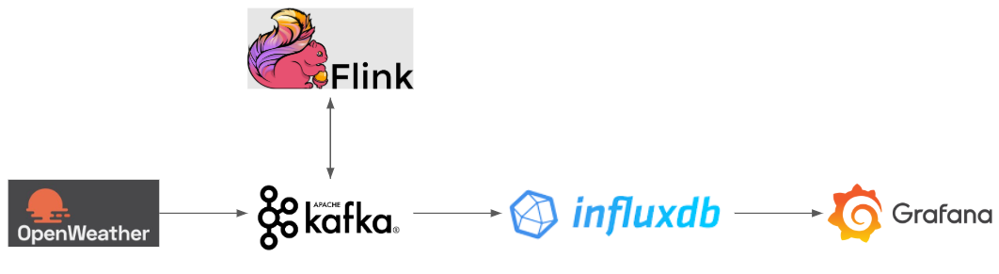

# Weather Data Pipeline

## Overview

The **Weather Data Pipeline** is a real-time system designed to fetch, process, and visualize weather data. It integrates various technologies such as **Kafka**, **Flink**, **InfluxDB**, and **Grafana**, all orchestrated using **Docker Compose**. 

This pipeline fetches weather data from the **OpenWeatherMap API**, processes it to calculate additional metrics such as the heat index, and visualizes the data using **Grafana dashboards**.

## Architecture

1. **OpenWeatherMap API**: 
   - Fetches real-time weather data.
   - Handled by `data_fetcher.py`, which publishes the data to a Kafka topic.

2. **Kafka**:
   - Acts as a messaging system with topics for raw and processed weather data.
   - Stores fetched weather data in the `weather_data` topic.

3. **Apache Flink**:
   - Consumes data from Kafka, processes it to calculate the **heat index**, and publishes the results to a new Kafka topic (`aggregated_weather_data`).
   - Managed by `flink_data_writer.py`.

4. **InfluxDB**:
   - A time-series database to store processed weather data.
   - Data is ingested from Kafka via `data_processor.py`.

5. **Grafana**:
   - Connects to InfluxDB to query and visualize the weather data.
   - Provides real-time dashboards for monitoring.

## Components

### 1. `data_fetcher.py`
- Fetches weather data from the **OpenWeatherMap API**.
- Publishes the fetched data to the Kafka topic `weather_data`.
- Built using `Dockerfile.fetcher`.

### 2. `flink_data_writer.py`
- Consumes raw weather data from the Kafka topic `weather_data`.
- Processes the data to calculate the **heat index**.
- Publishes the processed data to the Kafka topic `aggregated_weather_data`.
- Built using `Dockerfile.flink_writer`.

### 3. `data_processor.py`
- Consumes processed data from the Kafka topic `aggregated_weather_data`.
- Sends the data to **InfluxDB** for storage and visualization.
- Built using `Dockerfile.processor`.

### 4. **InfluxDB & Grafana**
- **InfluxDB** stores the processed data.
- **Grafana** connects to InfluxDB to create real-time visualizations.

### 5. **Docker Compose**
- Orchestrates the following containers:
  - Kafka
  - Flink
  - InfluxDB
  - Grafana
  - Custom containers for `data_fetcher.py`, `flink_data_writer.py`, and `data_processor.py`.

## File Structure

The repository is organized as follows:

weather_data_pipeline/
├── data_fetcher.py          # Fetches data from OpenWeatherMap and sends it to Kafka

├── data_processor.py        # Processes Kafka messages and sends them to InfluxDB

├── flink_data_writer.py     # Processes data with Flink and publishes results to Kafka

├── Dockerfile.fetcher       # Dockerfile for data_fetcher.py

├── Dockerfile.flink_writer  # Dockerfile for flink_data_writer.py

├── Dockerfile.processor     # Dockerfile for data_processor.py

├── config.yaml              # Configuration file for API keys and settings

├── docker-compose.yml       # Docker Compose file to orchestrate services

├── README.md                # Project documentation

└── requirements.txt         # Python dependencies
